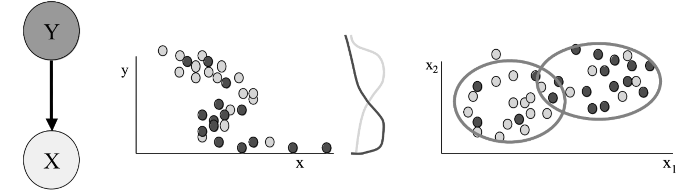

# Awesome-Distribution-Shift
A curated list of Distribution Shift papers/articles and recent advancements.

Data distribution shift refers to the phenomenon in supervised learning when the data a model works with changes over time, which causes this model’s predictions to become less accurate as time passes. The distribution of the data the model is trained on is called the source distribution. This repo contains a curated list of Distribution Shift papers/articles and recent advancements in Machine learning.

  

##### Table of Contents

1. [Papers](#Distribution Shift papers)  
2. [Code](#Code)
3. [datasets](#Datasets)
4. [Tutorials](#Tutorials)
5. [Researchers](#Researchers)

- **agarwal22b.pdf**
  - [[Paper]](https://proceedings.mlr.press/v178/agarwal22b/agarwal22b.pdf)
- **2202.08944.pdf**
  - [[Paper]](https://arxiv.org/pdf/2202.08944.pdf)
